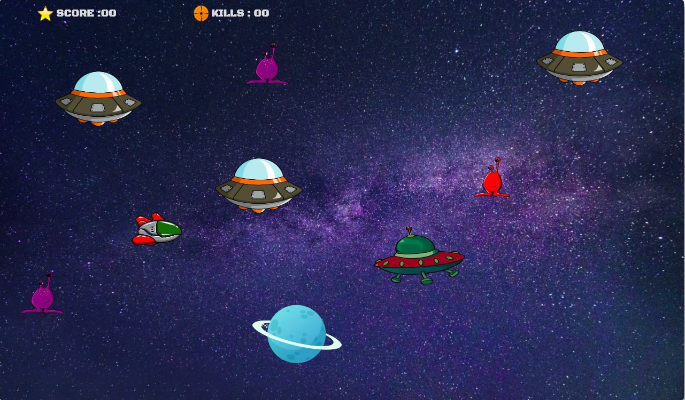
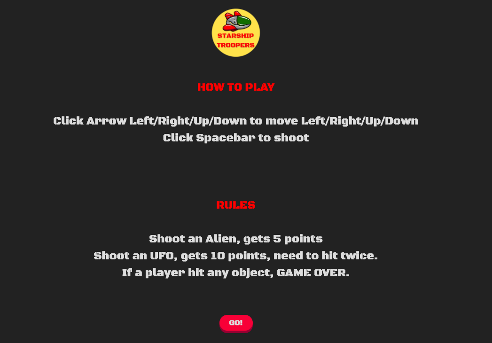

[Starship-Troopers-Frontend-Here](https://github.com/Tanattha/starship-troopers-frontend)

## Starship-Troopers-Backend

Resources, models, controllers and associations included. Fully functional CRUD, MVC and RESTful conventions. It also uses Fetch API to interface for fetching resources across the network. 



## Live App

[CLICK HERE](https://tanattha.github.io/starship-troopers-frontend)

## Video Walkthrough

[CLICK HERE](https://youtu.be/MRv4XRmLPM4)

## How to play



## Installation

```
clone this repo
cd starship-troopers-backend
rails db:create
rails db:migrate
rails db:seed #(optional, only if you want users and scores data)
rails s
```

## License

The gem is available as open source under the terms of the [MIT License](https://opensource.org/licenses/MIT).

## Special Thanks

https://www.clipartmax.com/<br />
https://www.remove.bg/upload<br />
https://www.zapsplat.com/<br />
https://www.pexels.com/<br />
https://favicon.io/<br />
[Font: Black Ops One Designed by James Grieshaber](https://fonts.google.com/specimen/Black+Ops+One#standard-styles)
<<<<<<< HEAD
and everything else from google!
=======

and everything else from google!

>>>>>>> 65dd6ad3b2c1cdd7f612b2f243dc93636bbdcd0e
